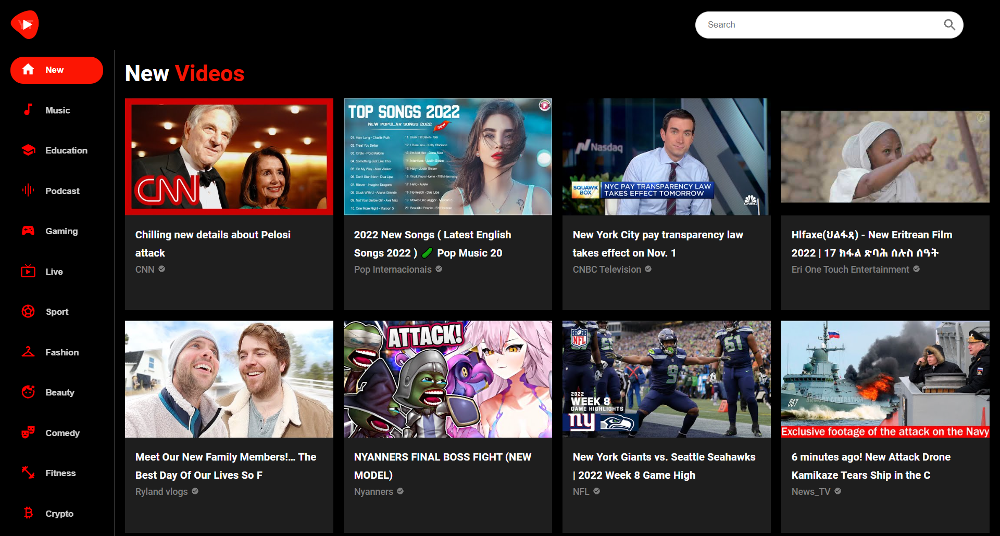

# React Youtube (Youtube Clone Application)

## Usage
In the project directory, you can run:
```
npm install
npm start
```

## Built with 
- [React](https://reactjs.org/)
- [Material UI](https://mui.com/)
- [React Player](https://github.com/CookPete/react-player)

## Screenshot

